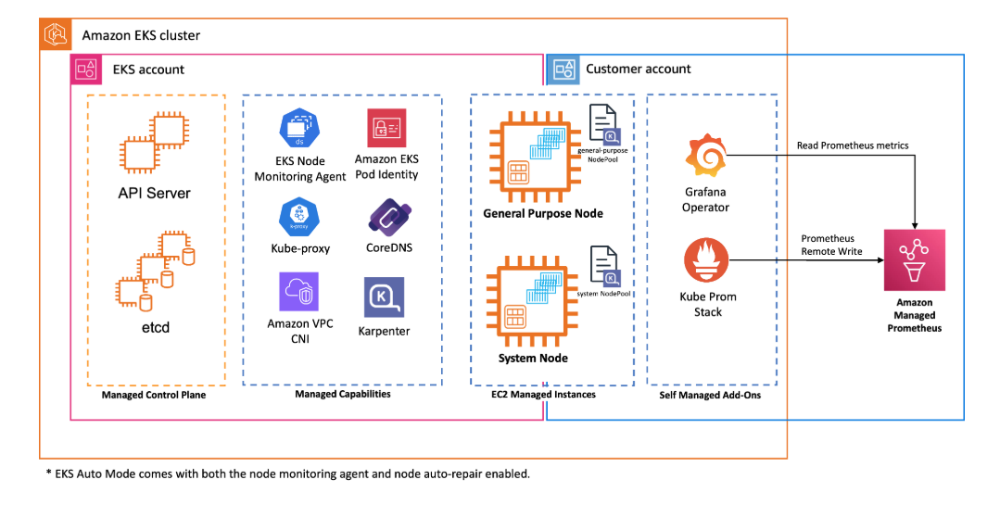

# Generative AI on Amazon EKS

Deploy and run Large Language Model (LLM) inference workloads on Amazon EKS with GPU acceleration, observability, and model storage — all provisioned with Terraform.



## What's Included

- **Terraform infrastructure** — EKS Auto Mode cluster, VPC, S3 model storage, Amazon Managed Prometheus, Grafana dashboards, and IAM roles
- **Kubernetes manifests** — Ready-to-deploy configurations for inference workloads

## Quick Start

```bash
git clone https://github.com/aws-samples/sample-genai-on-eks.git
cd sample-genai-on-eks/terraform

terraform init
terraform apply
```

> Deployment takes ~20-25 minutes. See [terraform/README.md](./terraform/README.md) for full details, configuration options, and troubleshooting.

## Prerequisites

- [AWS CLI](https://docs.aws.amazon.com/cli/latest/userguide/getting-started-install.html) (>= 2.x)
- [Terraform](https://developer.hashicorp.com/terraform/install) (>= 1.3)
- [kubectl](https://kubernetes.io/docs/tasks/tools/)
- AWS account with GPU instance quota

## Target Audience

This workshop is intended for Machine Learning Scientists/Engineers, Data Scientists/Engineers, Prompt Engineers, Developers, and Technical Founders.

While not mandatory, participants will benefit from:

- Basic knowledge of ML frameworks (PyTorch, Hugging Face Transformers)
- Fundamental understanding of Kubernetes concepts
- Familiarity with Python programming

New to Amazon EKS? We recommend completing the [EKS Workshop](https://www.eksworkshop.com/) first.

## Workshop Instructions

Follow the step-by-step guide: [GenAI on EKS Workshop](https://catalog.workshops.aws/genai-on-eks/en-US/50-getting-started/01-self-paced)

## Repository Structure

```
.
├── terraform/          # Infrastructure as Code (EKS, VPC, S3, AMP, Grafana)
│   ├── grafana-dashboards/   # Pre-built Grafana dashboard JSON files
│   ├── main.tf               # Provider and locals configuration
│   ├── eks.tf                # EKS cluster and S3 CSI driver
│   ├── vpc.tf                # VPC and networking
│   ├── helm.tf               # Observability stack (Prometheus, Grafana)
│   ├── amp.tf                # Amazon Managed Prometheus
│   ├── variables.tf          # Configurable variables
│   └── ...
└── manifests/          # Kubernetes manifests for inference workloads
```

## Cleanup

```bash
cd terraform
terraform destroy
```

## Security

See [CONTRIBUTING](CONTRIBUTING.md#security-issue-notifications) for more information.

## License

This library is licensed under the MIT-0 License. See the LICENSE file.
